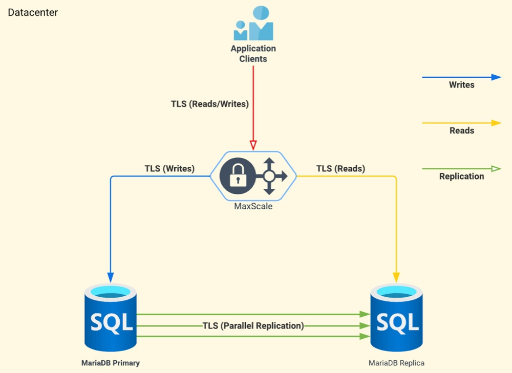

# MariaDB replication using MaxScale (SSL)



## Prerequisite

- Ubuntu 22.04
- [Traefik](https://github.com/rendyproklamanta/docker-swarm-traefik) (optional: for domain pointing to service like PMA, maxscale)

## Stacks

- MariaDB 11.x
- Docker Swarm
- Maxscale 21.06
- PhpMyAdmin

## Included

- [x] [Secure server & client: TLS/SSL](https://mariadb.com/kb/en/securing-connections-for-client-and-server)
- [x] [Encryption: Data-at-Rest](https://mariadb.com/kb/en/data-at-rest-encryption-overview/)
- [x] [Maxscale firewall: Query Blacklist Filter](https://mariadb.com/kb/en/mariadb-maxscale-24-database-firewall-filte)
- [x] Backup schedule by cron

## Not Included (optional)

- [Backup to S3](https://github.com/rendyproklamanta/docker-mysql-backup-s3)
- [User password rotation](https://github.com/rendyproklamanta/docker-mysql-credential-rolling) - to prevent credential leaks

## Servers

- Master
- Slave1

## Steps

**1. Create dir and clone**

```shell
mkdir -p /var/lib/mariadb
cd /var/lib/mariadb
git clone https://github.com/rendyproklamanta/docker-mariadb-replication-ssl.git .
```

---

**2. Change Password by using text replacing tool**

```shell
cd /var/lib/mariadb
find -type f -exec sed -i 's/REPL_PASSWORD_SET/YOUR_PASSWORD/g' {} +
find -type f -exec sed -i 's/MAXSCALE_PASSWORD_SET/YOUR_PASSWORD/g' {} +
find -type f -exec sed -i 's/MASTER_ROOT_PASSWORD_SET/YOUR_PASSWORD/g' {} +
find -type f -exec sed -i 's/SLAVE1_ROOT_PASSWORD_SET/YOUR_PASSWORD/g' {} +
find -type f -exec sed -i 's/SUPERUSER_PASSWORD_SET/YOUR_PASSWORD/g' {} +
find -type f -exec sed -i 's/SUPERADMIN_PASSWORD_SET/YOUR_PASSWORD/g' {} +
```

---

**3. Change domain PMA**

```shell
nano /var/lib/mariadb/services/pma/docker-compose.yaml 
```

---

**4. Adding port to firewall**

```shell
ufw allow 3306
ufw allow 6033
ufw allow 3301
ufw allow 3302
ufw allow 8989
```

**5. Move start.sh to safety place**

```shell
cd /var/lib/mariadb
mv start.sh /etc/init.d/start.sh
```

**6. Set permission and start!**

```shell
cd /etc/init.d
chmod +x start.sh && ./start.sh
```

- Test reboot :

```shell
sudo reboot
```

- Check service status after reboot :

```shell
sudo journalctl -u mariadb-repl.service
```

---

## Access

- Access database using PMA

> We recomend using domain for PMA to enable SSL with traefik

```shell
Link : http://[YOUR_IP_ADDRESS]:8000 OR https://pma.secure.domain.com 
user : super_adm
pass : SUPERADMIN_PASSWORD_SET
```

- Access using Mysql-client like workbench, navicat, etc..

```shell
host : [YOUR_IP_ADDRESS]
user : super_adm
pass : SUPERADMIN_PASSWORD_SET
port : 6033
```

- Access MaxScale web UI

```shell
Link : http://[YOUR_IP_ADDRESS]:8989
user : admin
pass : mariadb
```

- Host & Port List

```shell
Maxscale
host : mariadb_maxscale
port : 6033
---------------------------
Master
host : mariadb_master
port : 3301
---------------------------
Slave1
host : mariadb_slave1
port : 3301
```

---

## Note

- If server down
- If GTID not sync between servers
- Execute start.sh again

```shell
./start.sh
```

---

## How to connect from application to server using SSL

- Copy all *.pem files to your application

- Example fo use (CI3 database.php)

```php
$db['default'] = array(
   ... # Other configs
   'encrypt' => array(
      'ssl_verify'  => FALSE,
      'ssl_ca'      => realpath('./application/third_party/db_certs/ca-cert.pem'),
      'ssl_key'     => realpath('./application/third_party/db_certs/client-key.pem'),
      'ssl_cert'    => realpath('./application/third_party/db_certs/client-cert.pem'),
    ),
)
```

## SQL Commands to check SSL

```shell
SHOW VARIABLES LIKE '%ssl%';
SHOW STATUS LIKE 'ssl_server_not%';
```

## Table encryption

- Encrypt table

```sql
ALTER TABLE table_name
ENCRYPTED=YES;
```

- Test encryption is ON

```sql
SELECT A.NAME, B.ENCRYPTION_SCHEME FROM information_schema.INNODB_TABLESPACES_ENCRYPTION B 
JOIN information_schema.INNODB_SYS_TABLES A ON A.SPACE = B.SPACE;
```
